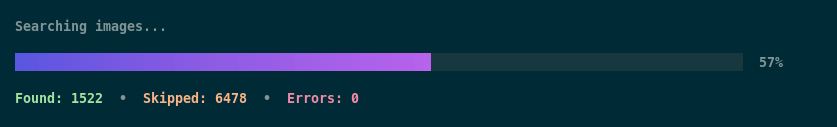

# 🌎 earth-view


CLI companion application for NixOS / Home Manager Nix module.

## Description

This Go module is a CLI application which allows to list and download image assets from the Google Earth View project. It is only intended to be used by the Nix modules declared in this repository.

The application uses [cobra](https://github.com/spf13/cobra) for documentation and flags / arguments parsing. The [`list`](#list) command uses Charm's [bubbletea](https://github.com/charmbracelet/bubbletea), [bubbles](https://github.com/charmbracelet/bubbles) and [lipgloss](https://github.com/charmbracelet/lipgloss) libraries for a nice TUI output.

## Documentation

* [Source](./cmd/root.go)

The main program does not do anything on its own. Instead, it provides various subcommands to perform actions on Google Earth View assets.

```plaintext
earth-view interacts with Google Earth View image assets.

Description:
  Google Earth View was originally a website to showcase and explore beautiful
  satellite views of various places on Earth. The website is now down but the
  assets still exist, as well as a Google Chrome extension to display them when
  a new tab is opened.

  The main goal of this program is to provide a convenient way to list the
  available images and download them on the filesystem.

Usage:
  earth-view [command]

Available Commands:
  fetch       Fetch images
  help        Help about any command
  list        Get images list

Flags:
  -h, --help   help for earth-view

Use "earth-view [command] --help" for more information about a command.
```

### `list`

* [Source](./cmd/list/main.go)



This command is used to generate the [`earth-view.json`](../earth-view.json) file which is used as a source of truth by the Nix modules.

It uses a batch mechanism to try every possible image identifier (known to be between 1000 and 15000) in order to generate a list of valid image identifiers.

```plaintext
Get a list of Google Earth View images

Description:
  This command will try to fetch images from gstatic.com using a known range of
  possible identifiers and generate a JSON array of valid identifiers for images.

  If the fetch succeeds, the image is added to the list.
  If the fetch fails with a 404 HTTP status code, the image is skipped.
  If the fetch fails with a non 200 HTTP status code, the error is reported and
  the image is skipped.

  By default, the generated list is output to the standard output. This
  behaviour can be changed by using the '--output' flag. If the provided value
  is a directory, the file will be named 'earth-view.json'.

Usage:
  earth-view list

Aliases:
  list, ls

Flags:
  -b, --batch-size int   number of parallel calls to gstatic.com
                         Using a high value may result in potentially wrong failures to fetch images (default 20)
  -h, --help             help for list
  -o, --output string    write to file instead of stdout
  -q, --quiet            do not output anything
  -r, --retry int        number of retries before skipping an image in case of non 200 HTTP status code (default 3)
```

### `fetch`

* [Source](./cmd/fetch/fetch.go)
* [Tests](./cmd/fetch/fetch_test.go)

This command allows to download an image by its identifier. It is the only command not used by the Nix modules.

```plaintext
Download a Google Earth View image by its identifier.

Description:
  The image metadata is first retrieved from gstatic.com (the server hosting the
  images assets) then the image is decoded before being saved on the filesystem.

  By default, the image is saved in the current working directory and its
  identifier is used as the filename. This behaviour can be changed by using the
  '--output' flag. If the provided value is a directory, the file is saved into
  it and the image identifier is used as the filename.

  If the output file exists, it is not overwritten. This behaviour can be
  changed by using the '--overwrite' flag.

Usage:
  earth-view fetch identifier
  earth-view fetch [command]

Aliases:
  fetch, get, download, dl

Available Commands:
  random      Fetch random images

Flags:
  -h, --help            help for fetch
  -o, --output string   write image to given file or directory
      --overwrite       overwrite output file if it exists

Use "earth-view fetch [command] --help" for more information about a command.
```

### `fetch random`

* [Source](./cmd/fetch/random.go)
* [Tests](./cmd/fetch/random_test.go)

This command is used by the Nix modules to actually download an image on the filesystem.

```plaintext
Download a random Google Earth View image.

Description:
  This command will download a random image using either the known possible
  image identifiers or an input file containing an array of identifiers in JSON
  format.

  The image metadata is first retrieved from gstatic.com (the server hosting the
  images assets) then the image is decoded before being saved on the filesystem.

  When '--input' flag is provided, the command expects it to be fed with a file
  containing the output of the 'list' command.

  When '--input' flag is not provided, a random image identifier will be chosen
  from the known range of possible identifiers. If the selected identifier is
  not valid, another one will be chosen, until a valid identifier is found.

  By default, the image is saved in the current working directory and its
  identifier is used as the filename. This behaviour can be changed by using the
  '--output' flag. If the provided value is a directory, the file is saved into
  it and the image identifier is used as the filename.

  If the output file exists, it is not overwritten. This behaviour can be
  changed by using the '--overwrite' flag.

Usage:
  earth-view fetch random

Aliases:
  random, rnd, rand

Flags:
  -h, --help            help for random
  -i, --input string    input file to choose an image from
  -o, --output string   write image to given file or directory
      --overwrite       overwrite output file if it exists
```

## Library

The `lib` package provides the [`Asset`](#asset) struct which is used to work with the assets and some [utility functions](#utilities) to work with files.

### Asset

[Source](./lib/asset.go)

```go
type Asset struct {
  Id       int
  raw      []byte
  Metadata map[string]interface{}
  Content  []byte
}
```

Objects of type `Asset` have three methods available:

* `(a *Asset) Fetch(retry int) error`: tries to fetch an asset from Gstatic using the `Id` struct field and stores it in the `raw` struct field
* `(a *Asset) GetMetadata() (map[string]interface{}, error)`: parses the asset JSON content and stores it in the `Metadata` struct field
  * since it relies on the `raw` struct field, it will call `Fetch()` on its own if needed
* `(a *Asset) GetContent() ([]byte, error)`: decode the asset image and stores it in the `Content` struct field
  * since it relies on the `Metadata` struct field, it will call `GetMetadata()` on its own if needed

Example usage:

```go
asset := lib.Asset{ Id: 1003 }
content, err := asset.GetContent()
```

### Utilities

[Source](./lib/utils.go)

Three utility functions are provided:

* `ResolveAbsFilePath(outPath string, defaultFilename string) (string, error)`: resolves the absolute path to a file
  * if `outPath` is a directory, it will be concatenated with `defaultFilename` to form the file path
  * else, the `defaultFilename` is used as the file path
  * this is useful to comply with the `--output` flag of [`fetch`](#fetch) and [`fetch random`](#fetch-random) commands, which can either be a file or a directory
* `FileExists(filePath string) bool`: check if a given file exists or not
* `WriteFile(content []byte, outPath string) error`: write content to a file with default `0644` permissions
